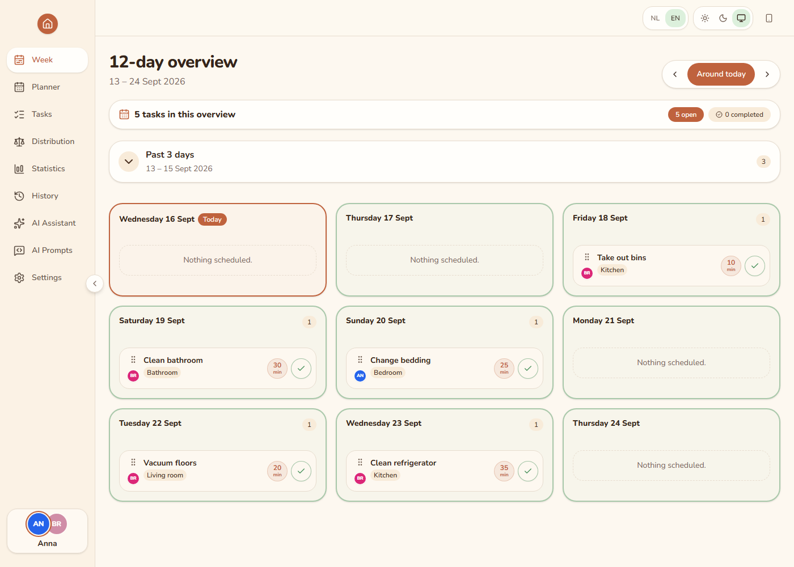
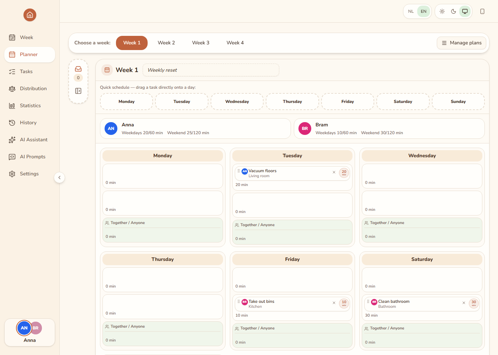
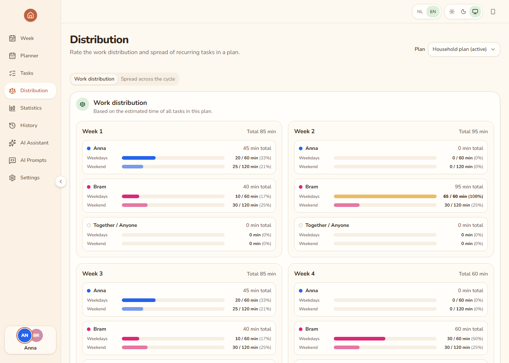

# Keep the House Clean

A self-hosted household chore planner that turns a reusable four-week schedule into a clear daily workflow. It helps everyone see what needs doing, divide the workload fairly, space recurring chores sensibly, and keep track of what was actually completed.

## Screenshots

### Daily and upcoming chores



### Four-week planner



### Work distribution



The screenshots use fictional people and sample chores.

## What it does

- Builds household schedules around a reusable four-week cycle.
- Shows today's chores, the upcoming days, and overdue work.
- Assigns chores to household members and separates weekday from weekend workload.
- Reviews workload per person, per week, and across the full cycle.
- Checks whether chores that occur multiple times per cycle are spread evenly.
- Records who completed, skipped, moved, or changed a chore.
- Exports printable daily, weekly, and complete chore lists as PDF.
- Supports Dutch and English, with English as the fallback language.
- Offers light, dark, and system colour modes.
- Works as an installable PWA and queues completions while temporarily offline.
- Can generate optional AI-assisted planning suggestions that require approval before they are applied.

> [!IMPORTANT]
> This application has no built-in authentication. Selecting a profile only records who performs an action; it is not a login. Keep the app on a trusted home network, use a VPN, or place it behind an authenticated reverse proxy.

## Quick start with Docker

You need Docker with Docker Compose.

1. Create the environment file.

   macOS or Linux:

   ```sh
   cp .env.example .env
   ```

   Windows PowerShell:

   ```powershell
   Copy-Item .env.example .env
   ```

2. Optionally edit `SEED_USERS` in `.env` to set the initial names and colours.

3. Build and start the application.

   ```sh
   docker compose up -d --build
   ```

4. Open <http://localhost:3000>.

On its first start, the application creates the base settings, household profiles, several rooms, and an empty active plan. Names, colours, rooms, holidays, and planning settings can then be changed under **Settings**.

The Docker stack contains:

- `app`: the Node.js application, including Chromium for PDF generation and `mongodump` for backups.
- `mongo`: MongoDB 8, with persistent data in the `mongo-data` volume.
- `./backups`: the host directory used for database backups.

To update an existing installation:

```sh
git pull
docker compose up -d --build
```

## Configuration

Configuration is read from `.env`; see [.env.example](.env.example) for a ready-to-use template.

- `APP_PORT` — host port used by Docker Compose; defaults to `3000`.
- `PORT` — server port inside the container; defaults to `3000`.
- `MONGO_URL` — MongoDB connection string, including the database name.
- `TZ_APP` — timezone used for dates, cycles, and scheduled jobs; defaults to `Europe/Amsterdam`.
- `SEED_USERS` — JSON array of profiles created only when no profiles exist yet.
- `LOG_LEVEL` — `fatal`, `error`, `warn`, `info`, `debug`, `trace`, or `silent`.
- `BACKUP_HOST_DIR` — host backup directory; defaults to `./backups`.
- `BACKUP_RETENTION_DAYS` — number of days to retain automatic backups; defaults to `14`.
- `AUDIT_RETENTION_DAYS` — optional maximum history age; empty keeps the complete history.
- `AI_API_KEY` — optional secret for the configured AI provider.
- `NOTIFY_TYPE` — `none`, `ntfy`, or `homeassistant`.
- `NOTIFY_URL` — ntfy topic URL or Home Assistant webhook URL.
- `NOTIFY_TOKEN` — optional bearer token for notifications.
- `DISABLE_SCHEDULER` — set to `true` to disable scheduled jobs, primarily for tests.

Some database, backup, package, and browser-storage identifiers retain the original `huishoudplanner` name for backward compatibility. Changing those identifiers could disconnect an existing installation from its data.

### Scheduled jobs

All times follow `TZ_APP`:

- `03:00` — generate upcoming cycles.
- `03:30` — create a database backup.
- `03:45` — remove old history when audit retention is enabled.
- `07:30` — send the morning notification when notifications are enabled.

## Backups and data transfer

The application creates a compressed `mongodump` archive every night in `./backups`. Files older than `BACKUP_RETENTION_DAYS` are removed after a successful backup.

Start a manual backup:

```sh
curl -X POST -H "X-Profile-Id: <profile-id>" http://localhost:3000/api/jobs/backup
```

Restore an archive:

```sh
docker compose exec app mongorestore \
  --uri="mongodb://mongo:27017" \
  --archive=/backups/huishoudplanner-20260916.archive.gz \
  --gzip --drop
docker compose restart app
```

> [!WARNING]
> `--drop` replaces the current database. Create a fresh backup before restoring an archive.

A full JSON export and import are also available under **Settings → Data**. Imports are validated before replacing the current data.

## Optional integrations

### AI planning suggestions

Under **Settings → AI assistant**, choose one of the supported providers:

- **Off** — the default.
- **Demo** — deterministic suggestions without an external AI service.
- **Anthropic** — with an optional model override.
- **OpenAI-compatible** — requires an endpoint and model.
- **Ollama** — for a locally hosted model; from Docker the endpoint is commonly `http://host.docker.internal:11434`.

Set `AI_API_KEY` in `.env` when the provider requires a secret, then restart the stack. Suggestions never become active automatically: review them and explicitly choose **Apply** or **Discard**.

### Notifications

Set `NOTIFY_TYPE` to `ntfy` or `homeassistant` to send each active profile a morning summary of today's and overdue chores. Profiles with nothing to do do not receive a message.

Example ntfy configuration:

```dotenv
NOTIFY_TYPE=ntfy
NOTIFY_URL=https://ntfy.sh/your-private-topic
```

Example Home Assistant webhook:

```dotenv
NOTIFY_TYPE=homeassistant
NOTIFY_URL=http://homeassistant.local:8123/api/webhook/your-webhook-id
```

## Security and remote access

- Do not expose the application directly to the public internet.
- Prefer a home network, WireGuard, Tailscale, or an authenticated reverse proxy.
- Enable HTTPS at the reverse proxy, especially when installing the PWA on a phone.
- MongoDB is not published to the host by the supplied Compose configuration; keep it private.

## Local development

You need Node.js 24 or newer, npm, and MongoDB 8.

Start a local MongoDB container:

```sh
docker run -d --name huishoudplanner-mongo -p 27017:27017 mongo:8
```

Install dependencies:

```sh
npm install
```

Start the API and Vite development servers on macOS or Linux:

```sh
MONGO_URL=mongodb://localhost:27017/huishoudplanner npm run dev
```

On Windows PowerShell:

```powershell
$env:MONGO_URL = "mongodb://localhost:27017/huishoudplanner"
npm run dev
```

The web development server is available at <http://localhost:5173> and proxies `/api` to the server on port `3000`.

Useful commands:

- `npm run verify` — run linting, type checking, and all unit, component, and API tests.
- `npm run test:e2e` — build the web app and run Playwright end-to-end tests.
- `npm run build` — build the web app into `apps/web/dist`.
- `node scripts/smoke.mjs` — run an isolated Docker smoke test without touching an existing installation.

Install the Playwright browser once before running end-to-end tests:

```sh
npx playwright install chromium
```

## Project structure

```text
packages/shared   Shared types, schemas, date and cycle logic, and plan validation
apps/server       Fastify API, MongoDB repositories, PDF export, AI, jobs, and backups
apps/web          React and Vite PWA, responsive UI, translations, and Playwright tests
docker            Production Dockerfile
scripts           Smoke-test tooling
docs              Project notes and public screenshots
```

## License

[](https://github.com/somali-lab/keep-the-house-clean-planner#license)

Released under the [MIT License](https://opensource.org/licenses/MIT) - free to use, modify, and share, with attribution to the original source.

Copyright (c) 2026 [somali-lab](https://github.com/somali-lab)
