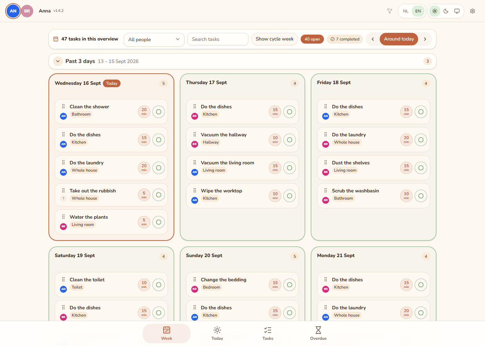
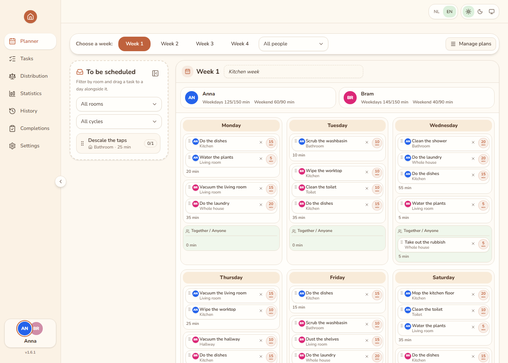
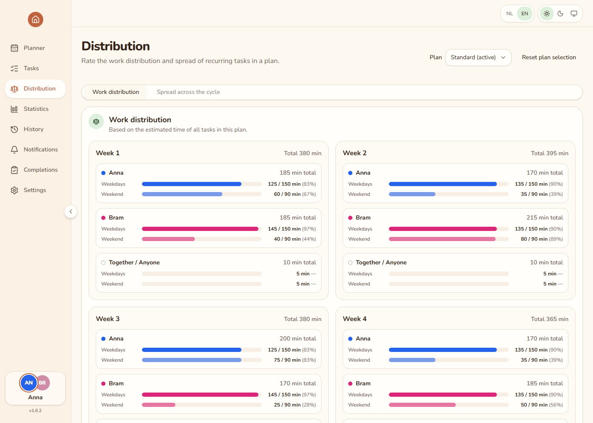

# Keep the House Clean

A self-hosted household chore planner that turns a reusable four-week schedule into a clear daily workflow. It helps everyone see what needs doing, divide the workload fairly, space recurring chores sensibly, and keep track of what was actually completed.

## Screenshots

### Daily and upcoming chores



### Four-week planner



### Work distribution



The screenshots show a scripted demo household with fictional people and sample chores. They are generated by `npm run screenshots`, so they can be refreshed whenever the interface changes.

## What it does

### Planning

- **Four-week cycle** - one reusable plan repeats every four weeks, and the app turns it into real tasks on real days.
- **Planner** - drag chores onto days and people; it warns about wrong frequencies and overloaded days, and refuses days someone is unavailable.
- **Plan management** - keep, copy and rename several plans; before another plan is activated, a preview shows which upcoming tasks are replaced and which stay.
- **Distribution** - check how the work is shared between people, weekdays and weekends, and whether recurring chores are spread evenly.
- **Vacations** - no tasks are generated on vacation days.
- **Plan suggestions** - when you keep moving the same task the same way, the app offers to update the plan.
- **AI drafts (optional)** - an AI assistant can propose, rebalance or explain a plan and suggest missing tasks; a proposal opens as a draft in plan management and changes nothing until you activate it.

### Daily use

- **Today** - the day's open chores: yours, unclaimed, other people's and overdue; look ahead a day or two.
- **Week** - a twelve-day overview with drag-to-reschedule, filter by person and search by name.
- **My tasks** - your chores and the unclaimed ones for the next 1, 2 or 4 weeks, in dated weekly blocks.
- **Overdue** - chores that are due or running behind their interval, ranked, with schedule, done now and extra.
- **Check off, skip, claim** - undo a check-off, skip with a reason, claim an unclaimed chore, and say who did it when it was someone else's.
- **Extra task** - record or plan work that was not in the plan: an extra time for a known task, or a one-off task that never enters the task list.

### Rewards

- **Points** - every completed chore earns points for the person who did it, one per minute unless set differently; the ledger corrects itself when a completion is undone or corrected.
- **Bonuses** - administrators can set bonuses for doing everything in a week or a cycle, and for doing it all on time, under **Settings → Calendar**.
- **Redemptions and money** - set a currency and what a point is worth; people redeem points for a payout or reward, never below their balance.
- **Badges** - administrators define badges with a picture and a rule; they are awarded automatically and taken back if the work is undone.
- **Reward meter** - the **Reward** tab shows progress towards the goal of the week or cycle with a chicken and a basket of eggs.

### Insight

- **Statistics** - workload, fairness, completion rate, rhythm against the planned interval, timing against the planned day, and points, each with a table.
- **History** - an audit trail of who completed, skipped, moved or changed what.
- **Completion corrections** - administrators can correct who finished a chore and when, or delete a completion.

### Notifications

- **Browser notifications** - personal reminders at times you choose, shown while the planner is open in a browser tab; they need HTTPS or `localhost`.
- **ntfy and Home Assistant** - an optional morning summary per person, sent by the server even when no browser is open.

### Data and app

- **PDF** - printable day, week, two-week and four-week schedules, an overdue list and a task list.
- **Export and import** - a full JSON export and import, next to nightly backups.
- **Installable and offline** - works as a PWA and queues check-offs while temporarily offline.
- **Languages and themes** - Dutch and English, and light, dark or system colours.
- **Filters** - filter choices are remembered per person, and one button in the header resets them for the current screen.
- **About** - the running version, the date and time of the latest release, and links to the license and changelog.

> [!IMPORTANT]
> This application has no built-in authentication. Selecting a profile only records who performs an action; it is not a login. Keep the app on a trusted home network, use a VPN, or place it behind an authenticated reverse proxy.

## Quick start with Docker

You need Docker with Docker Compose.

1. Create the environment file.

   macOS or Linux:

   ```sh
   cp .env.example .env
   ```

   Windows PowerShell:

   ```powershell
   Copy-Item .env.example .env
   ```

2. Optionally edit `SEED_USERS` in `.env` to set the initial names and colours.

3. Build and start the application.

   ```sh
   docker compose up -d --build
   ```

4. Open <http://localhost:3000>.

On its first start, the application creates the base settings, household profiles (the first one is an administrator, the others are members), several rooms, and an empty active plan. Names, colours, rooms, holidays, and planning settings can then be changed under **Settings**.

The Docker stack contains:

- `app`: the Node.js application, including the headless Chromium shell for PDF generation.
- `mongo`: MongoDB 8, with persistent data in the `mongo-data` volume.
- `backup`: a separate MongoDB-tools container that creates and retains database archives.
- `./backups`: the host directory used for database backups.

To update an existing installation:

```sh
git pull
docker compose up -d --build
```

## Releases and container images

Releases are automated with semantic versions and generated release notes. Each release publishes a `linux/amd64` image to:

```text
ghcr.io/somali-lab/keep-the-house-clean-planner
```

Published tags include the full version (`1.4.2`), rolling minor and major tags (`1.4` and `1`), `latest`, and an immutable `sha-<commit>` tag. See [Releasing](docs/RELEASING.md) for the release flow and the one-time repository settings.

The About page in the management menu shows which build is running. A published image shows its release version and the date and time of that release; a build from local source is marked as local and shows no release date, because it is not a release.

The repository also uses GitHub Agentic Workflows to check its coding-agent
instructions, requirements, and feature description after releases and once a week. See
[Agentic workflow checks](docs/AGENTIC-WORKFLOWS.md) for the triggers, review
scope, security boundaries, generated files, and maintenance commands.

## Configuration

Configuration is read from `.env`; see [.env.example](.env.example) for a ready-to-use template.

- `APP_PORT` — host port used by Docker Compose; defaults to `3000`.
- `PORT` — server port inside the container; defaults to `3000`.
- `MONGO_URL` — MongoDB connection string, including the database name.
- `TZ_APP` — timezone used for dates, cycles, and scheduled jobs; defaults to `Europe/Amsterdam`.
- `SEED_USERS` — JSON array of profiles created only when no profiles exist yet.
- `LOG_LEVEL` — `fatal`, `error`, `warn`, `info`, `debug`, `trace`, or `silent`.
- `APP_IMAGE_TAG` — image tag used by Docker Compose; defaults to `latest`.
- `BACKUP_HOST_DIR` — host backup directory; defaults to `./backups`.
- `BACKUP_RETENTION_DAYS` — number of days the backup container retains automatic backups; defaults to `14`.
- `AUDIT_RETENTION_DAYS` — optional maximum history age; empty keeps the complete history.
- `AI_API_KEY` — optional secret for the configured AI provider.
- `NOTIFY_TYPE` — `none`, `ntfy`, or `homeassistant`.
- `NOTIFY_URL` — ntfy topic URL or Home Assistant webhook URL.
- `NOTIFY_TOKEN` — optional bearer token for notifications.
- `DISABLE_SCHEDULER` — set to `true` to disable scheduled jobs, primarily for tests.

Some database, backup, package, and browser-storage identifiers retain the original `huishoudplanner` name for backward compatibility. Changing those identifiers could disconnect an existing installation from its data.

### Scheduled jobs

All times follow `TZ_APP`:

- `03:00` — generate upcoming cycles and reconcile the points ledger with the completed work, which also finalises the week and cycle bonuses of the periods that ended. The badge awards are recomputed from the same data.
- `03:30` — the separate backup container creates a database backup.
- `03:45` — remove old history when audit retention is enabled.
- `07:30` — send the ntfy or Home Assistant morning notification when `NOTIFY_TYPE` is set. Browser notifications use each person's own times and do not run on the server.

## Backups and data transfer

The separate `backup` container creates a compressed `mongodump` archive every night in `./backups`. Files older than `BACKUP_RETENTION_DAYS` are removed after a successful backup.

Start a manual backup:

```sh
docker compose run --rm backup once
```

Restore an archive:

```sh
docker compose run --rm --entrypoint mongorestore backup \
  --uri="mongodb://mongo:27017" \
  --archive=/backups/huishoudplanner-20260916.archive.gz \
  --gzip --drop
docker compose restart app
```

> [!WARNING]
> `--drop` replaces the current database. Create a fresh backup before restoring an archive.

A full JSON export and import are also available under **Settings → Data**. Imports are validated before replacing the current data. The export includes the badge definitions with their pictures and the redemptions; the points and badge awards are rebuilt from the imported work. Importing an older file that would remove existing redemptions or badges first asks you to confirm that.

## Optional integrations

### AI planning suggestions

Under **Settings → AI**, choose one of the supported providers:

- **Off** — the default.
- **Demo** — deterministic suggestions without an external AI service.
- **Anthropic** — with an optional model override.
- **OpenAI-compatible** — requires an endpoint and model.
- **Ollama** — for a locally hosted model; from Docker the endpoint is commonly `http://host.docker.internal:11434`.

Set `AI_API_KEY` in `.env` when the provider requires a secret, then restart the stack. A proposed plan never becomes active automatically: it opens as a draft in plan management, where you can edit it, delete it, or activate it after reviewing the preview of what changes. Suggested tasks are only added when you choose to add them.

### Notifications

There are two separate kinds of notification.

**Browser notifications** are personal and need no configuration. Under **Notifications** in the management area, each person switches them on, sets up to six times of day (household timezone) and grants the browser permission with the **Ask for permission** button. **Send test notification** checks that this device shows them. At each set time the person's open tasks for today and their overdue tasks are shown as one notification; nothing open means no notification. They only appear while the planner is open in a browser tab, also when that tab is not active, and a moment that was missed by more than ten minutes is skipped. With several tabs open only one notification is shown. Browsers only allow notifications on HTTPS (for example through the reverse proxy) or on `localhost`: browser notifications do not work on a plain-HTTP address on the home network such as `http://192.168.x.x:3000` or `http://huis.local`, and the page then says so. Permission is per device and browser. An administrator can set the times of any person.

**ntfy and Home Assistant** notifications are configured in the environment and also reach people when no browser is open. Set `NOTIFY_TYPE` to `ntfy` or `homeassistant` to send each active profile a morning summary of today's and overdue chores. Profiles with nothing to do do not receive a message.

Example ntfy configuration:

```dotenv
NOTIFY_TYPE=ntfy
NOTIFY_URL=https://ntfy.sh/your-private-topic
```

Example Home Assistant webhook:

```dotenv
NOTIFY_TYPE=homeassistant
NOTIFY_URL=http://homeassistant.local:8123/api/webhook/your-webhook-id
```

## Security and remote access

- Do not expose the application directly to the public internet.
- Prefer a home network, WireGuard, Tailscale, or an authenticated reverse proxy.
- Enable HTTPS at the reverse proxy. It is required for browser notifications and for installing the PWA on a phone: browsers disable both on a plain-HTTP LAN address.
- MongoDB is not published to the host by the supplied Compose configuration; keep it private.

## Local development

You need Node.js 24 or newer, npm, and MongoDB 8.

Start a local MongoDB container:

```sh
docker run -d --name huishoudplanner-mongo -p 27017:27017 mongo:8
```

Install dependencies:

```sh
npm install
```

Start the API and Vite development servers on macOS or Linux:

```sh
MONGO_URL=mongodb://localhost:27017/huishoudplanner npm run dev
```

On Windows PowerShell:

```powershell
$env:MONGO_URL = "mongodb://localhost:27017/huishoudplanner"
npm run dev
```

The web development server is available at <http://localhost:5173> and proxies `/api` to the server on port `3000`.

Useful commands:

- `npm run verify` — run linting, type checking, and all unit, component, and API tests.
- `npm run test:e2e` — build the web app and run Playwright end-to-end tests.
- `npm run build` — build the web app into `apps/web/dist`.
- `npm run screenshots` — regenerate the README screenshots from a scripted demo household.
- `node scripts/smoke.mjs` — run an isolated Docker smoke test without touching an existing installation.

Dependabot checks npm dependencies monthly. It groups compatible minor and patch development updates; TypeScript is reviewed separately against `typescript-eslint`'s peer range. Major updates to TypeScript, Node type declarations, and jsdom are held until the project's tooling or supported Node version can use them. See [`.github/dependabot.yml`](.github/dependabot.yml) for the rules.

Install the Playwright browser once before running end-to-end tests:

```sh
npx playwright install chromium
```

## Project structure

```text
packages/shared   Shared types, schemas, date and cycle logic, and plan validation
apps/server       Fastify API, MongoDB repositories, PDF export, AI, jobs, and backups
apps/web          React and Vite PWA, responsive UI, translations, and Playwright tests
docker            Production Dockerfile
scripts           Smoke-test tooling
docs              Project notes and public screenshots
```

## License

[](https://github.com/somali-lab/keep-the-house-clean-planner#license)

Released under the [MIT License](https://opensource.org/licenses/MIT) - free to use, modify, and share, with attribution to the original source.

Copyright (c) 2026 [somali-lab](https://github.com/somali-lab)
